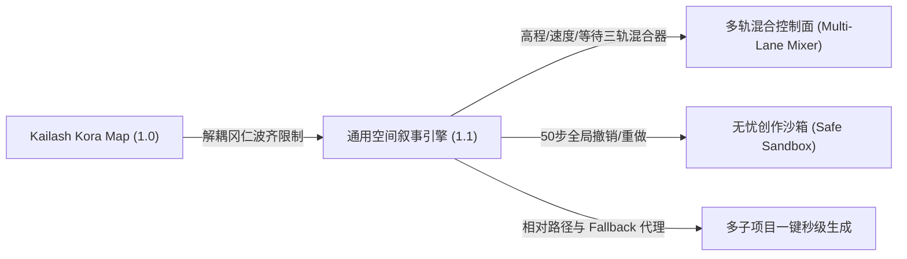

# 空间叙事引擎 (Spatial Narrative Engine) 架构设计与演进纪录

本文件记录了“空间叙事引擎”从冈仁波齐 3D 漫游地图到全球化、零数据起航的空间故事创作平台的演进路线、系统架构和核心设计。

---

## 1. 演进路线：从“神山预演”到“全球空间叙事”

最初，本项目是为了冈仁波齐转山朝圣者开发的 3D 漫游与互助工具。随着系统的迭代，我们发现其底层的 **“三维空间 - 二维时间线（运镜、速度、停留）”** 联动编辑机制具有极强的普适性。

因此，我们对系统进行了彻底的重构，将其演进为一套通用的**全球空间叙事引擎 (Spatial Narrative Engine)**：



*   **1.0 阶段**：绑定在冈仁波齐的坐标体系、POI 列表、写死的航线节点下。
*   **1.1 阶段**：完全解耦空间限制。项目支持全球任意经纬度起航（无数据时全球 10,000km 视角俯瞰，有数据时自动聚焦首站）；引入了底部的三通道 Canvas 混合器；支持了 Shift / Ctrl 批量多选调参；添加了 50 步撤销历史；实现了轻量化的后台多项目创建。

---

## 2. 系统架构 (System Architecture)

引擎采用前后端轻量分离架构。前端利用 CesiumJS 进行 3D 空间计算与渲染，后端基于 Node.js Express 提供接口与静态资源的 Fallback 代理服务。

### 2.1 整体拓扑

```
[前端 Web 浏览器]
       |
       +---> 请求项目数据: `/[project-id]/api/save-routes`  (使用相对路径自动适配)
       +---> 加载 HTML/JS: `/[project-id]/flight-editor.html`
       |
[Node.js 后端服务器 (server.js)]
       |
       +---> 检查本地是否存在 `/[project-id]/flight-editor.html`
       |        |-- 存在: 直接返回子项目特化文件
       |        +-- 不存在: 自动代理并返回根目录下的静态代码资产 (Fallback Serving)
       |
       +---> 读取/写入磁盘 `/[project-id]/data/routes.json` 
```

### 2.2 静态资源 Fallback 代理机制
为了避免新建子项目时大量复制 HTML, CSS, JS, 图像等基础代码资产（每份拷贝重达数百 MB 且极难同步维护），后端设计了 **静态 Fallback 代理路由**：
1. 当前端访问 `http://localhost:8090/projectName/flight-editor.html` 时，Node.js 检查 `projectName/flight-editor.html` 在磁盘上是否存在。
2. 若不存在，Node.js 会自动将请求映射到根目录的 `/flight-editor.html` 进行服务。
3. 所有的 AJAX 接口与资源引用皆使用相对路径（例如 `api/save-routes` 或 `../assets/...`），使浏览器能够自动且精准地将请求解析在 `/projectName/` 的子项目上下文中，将读写物理隔离在 `/projectName/data/routes.json`。

---

## 3. 核心功能解构 (Core Features)

### 3.1 三通道纵向分轨混合面板 (Multi-Lane Stacked Mixer)
编辑器底部的核心操控台由 HTML5 Canvas 绘制（逻辑封装在 `3d/js/elevation_chart.js` 中），在垂直高度上被拆分为三大独立的控制通道：

1.  **高程通道 (Elevation Lane - 55% 区域)**：
    *   **地面海拔 (DEM)**：呈半透明泥沙暖灰色（`#a8a29e`）的实心填充，代表地形的物理起伏。
    *   **机位海拔 (ALT)**：呈天青蓝（`#60a5fa`）的折线，代表相机的绝对海拔高度。
    *   **投射指引 (Anchor Line)**：两条曲线间的空隙绘制半透明虚线，代表镜头的离地净空高度（Relative Altitude）。
2.  **速度通道 (Speed Lane - 20% 区域)**：
    *   折线呈薄荷绿（`#2dd4bf`），控制当前航点到下一航点的飞行速度（0 - 80 km/h）。
3.  **驻留通道 (Wait Lane - 20% 区域)**：
    *   折线呈丁香紫（`#c084fc`），控制相机在该航点悬停等待的时长（0 - 15秒）。

### 3.2 水平滑擦与 3D 所见即所得联动 (Synchronized 3D Scrubbing)
*   **交互逻辑**：在混合器 Canvas 空白处按住水平拖动，一根白色的播放头线（Playhead）会跟随鼠标。
*   **插值计算**：系统根据播放头的 X 轴坐标，计算出其在整条飞航路线中的精确进度百分比，在相邻的两个物理航点间进行**三维线性与视角缓动插值**，实时驱动 Cesium 3D 相机更新（`lng, lat, height, heading, pitch, roll, fov`），提供极致的“所滑即所见”体验。

### 3.3 3D 物理轨迹可视化与 Look Track (镜头视线)
*   **悬空空中轨迹线**：不再是死板贴地的线条，而是将相机的绝对飞行轨迹以三维三维空间发光曲线（PolylineGlow）在空中渲染出来。
*   **相机下坠锚线**：为悬空航点在 3D 场景中渲染出直达地表的虚线，帮助导演直观校准镜头距离地面的位置。
*   **Look Track 视线矢量**：在 3D 场景里为每个航点绘制 150 米长的**镜头朝向矢量线段**。当前选中航点为高亮薄荷绿，其他为半透明白，让每一个航点指向哪一扇山门、哪一个谷底一目了然。
*   **锁定目标连线**：若航点配置了视线对焦（如锁定冈仁波齐主峰），相机会渲染一条金黄色（当前选中）或灰色（其他航点）的虚线直达对焦地表目标。

### 3.4 50 步多级操作历史记录栈 (History Transactions)
*   为了防止导演编辑航线、加减航点、拖动曲线、重置导演轨时的误操作风险，引入了全局 **History Stack**。
*   在执行任何修改前，系统会自动对当前的整个 `routes` 数组进行深拷贝（Deep Copy）并压入 `historyStack`（上限 50 步）。
*   左上角“↩ 撤销”按钮高亮显示当前可以退回的步骤数，并支持一键恢复。即使导演误点击了“清空导演轨”，也可以通过撤销键一键还原。

---

## 4. 关键数据结构规范

引擎消费两个核心 JSON 文件：`routes.json` (导演航线轨迹) 和 `pois.json` (地理地标/故事节点)。

### 4.1 航线数据规范 (`routes.json`)
```json
[
  {
    "lng": 81.28540,
    "lat": 31.09630,
    "elevation": 4652,     // 真实地面海拔 (m)
    "range": 500,           // 镜头离地净空高度 (m)
    "heading": 320.5,       // 相机航向角 (0-360)
    "pitch": -30.0,         // 相机俯仰角 (-90-90)
    "roll": 0.0,
    "fov": 60,              // 镜头焦距/视场角 (度)
    "speed": 25,            // 飞往下一段的速度 (km/h)
    "wait": 2,              // 在此站点的停留时间 (s)
    "focusMode": "poi",     // 镜头对焦模式: "forward"(向前看) | "poi"(对焦最近地标) | "kailash"(凝望主峰)
    "handheld": true        // 是否开启手持抖动模拟
  }
]
```

### 4.2 地标故事数据规范 (`pois.json`)
```json
[
  {
    "id": "msn_dirapuk",
    "name": "止热寺",
    "lng": 81.3025,
    "lat": 31.1148,
    "note": "海拔 5210 米，是凝望冈仁波齐北壁的最佳位置。",
    "bubble": "<h3>止热寺 (Drira Puk)</h3><p>面对巍峨的冈仁波齐北壁，此处常年积雪...</p>",
    "flat": false           // false 代表 3D 立体地标 (带垂直悬吊支架)；true 代表贴地文字
  }
]
```

---

## 5. 项目发布与部署指南

1.  **新建项目**：
    *   在管理后台 `admin.html` 点击 `➕ 新建项目`。
    *   输入项目文件夹名称（如 `kailash-debug` 或 `grand-canyon`）。
    *   选择是否初始化为空白项目：
        *   **空白项目**：系统自动生成空的 `routes.json` 与 `pois.json`，并将相机视口拉退到 10000 km 俯视地球的姿态，导演可以在地球上任意位置左击标绘航点。
        *   **模板拷贝**：系统拷贝默认的冈仁波齐转山路线与地标，在此基础上修改。
2.  **编辑调试**：
    *   在 `flight-editor.html` 中拖动海拔、速度、停留时间，或在 3D 视图中移动相机捕捉新节点。
    *   系统会自动发送相对 API 请求保存至对应项目目录。
3.  **成果预览**：
    *   点击管理后台中的 `👁️ 预览前台成果`。
    *   页面会以 `/projectName/3d/index.html` 形式打开。该页面会动态读取最新的 `routes.json` 数据并播放转山 3D 特效与解说。
4.  **保存与版本库推送**：
    *   修改完成后，可以点击 `💾 保存更改`，系统会自动将该项目子文件夹下的更改通过 Git 提交并推送到版本库。
