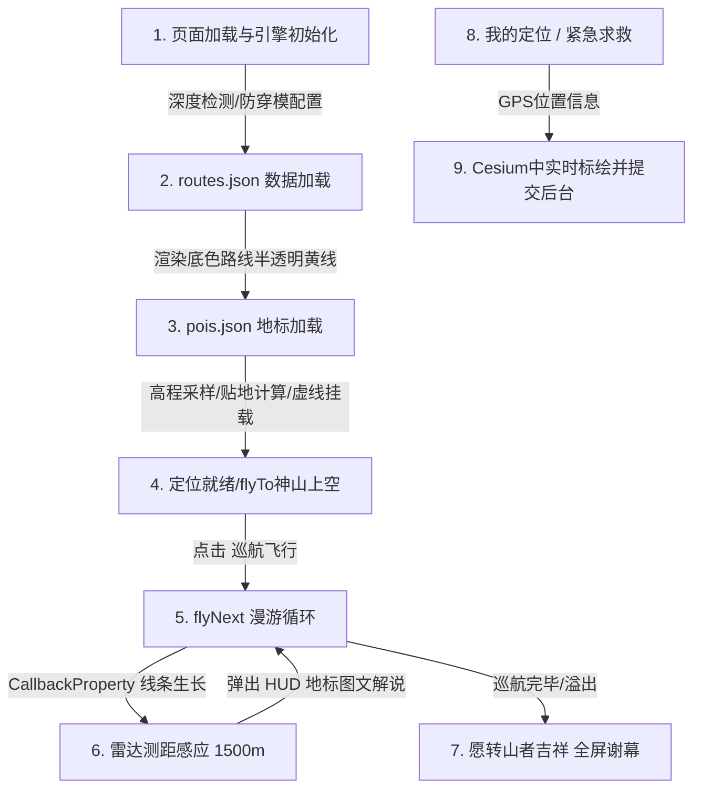

# 冈仁波齐神山 3D 漫游地图技术原理与代码解读

本项目是一个面向西藏阿里冈仁波齐转山朝圣者的 3D 漫游预演与互助平台。通过整合 2D Leaflet 扁平端和 3D CesiumJS 空间立体端，为朝圣者提供沉浸式的航线模拟、雷达导游和紧急求救可视化。本文档将重点解构 3D 端中 Cesium 的核心作用、全业务流程以及核心底层代码。

---

## 一、 Cesium 在项目中的核心作用

1. **真实三维地貌与海拔感知（3D Terrain Visualization）**  
   转山路线（如卓玛拉垭口）海拔高达 5600m 以上，地形起伏极为剧烈。Cesium 引入高精度数字高程模型（Cesium World Terrain），让用户能直观感受到冈仁波齐峰的巍峨以及高海拔谷地的陡峭压迫感，从而做足出行安全心理准备。
2. **高精度地标贴地高程采样（sampleTerrainMostDetailed & CLAMP_TO_GROUND）**  
   初始的地标数据（如止热寺、祖楚寺、补给点）在 `pois.json` 中仅有 2D 经纬度。Cesium 引擎通过异步采样最精细的网格高程，解决了图标在 3D 地图中悬空或陷入山体下的问题。同时，系统针对地表上的指示物使用贴地约束，对立面地标创建三维虚线支架，兼顾了图表的美学和地理准确性。
3. **动态飞行路线生长特效（Dynamic Path Growth）**  
   利用 `Cesium.CallbackProperty` 和 `PolylineGlowMaterialProperty`（发光线条材质），根据漫游进度，动态截取已飞过航段的坐标。在 3D 场景中，一条明黄色的发光路线会随着漫游飞行实时向前延展生长，具有极佳的动态交互体验。
4. **雷达空间距离探测机制（Radar Proximity Sensing）**  
   在航行递归循环中，每一帧都通过 `Cesium.Cartesian3.distance` 实时计算相机坐标与所有地标的直线距离。一旦进入 1500 米雷达警戒半径，自动触发解说，向屏幕下方的毛玻璃面板（HUD）推送该地标的历史传说、实用避坑指南，实现“随走随讲”的智能导游。
5. **位置标绘与紧急求救可视化（Geolocation & Emergency SOS）**  
   结合浏览器的 Geolocation API。当朝圣者遭遇高反或迷路时，可以在移动端发起“紧急求助”，系统提取精确 GPS 经纬度，并在 Cesium 三维山谷中实时绘制带有外发光的蓝色（我的定位）或红色（求救信标）脉冲晕圈，将文字求救转化为直接的空间地理坐标，便于组织线上线下的搜救。

---

## 二、 3D 端核心业务流程 (Flow)



1. **底座初始化**  
   加载 CesiumJS 引擎，关闭时间线、动画条等无关控件。配置抗锯齿，开启 `depthTestAgainstTerrain = true`（深度测试，防止地标标记被山体遮挡后发生透视穿模）。
2. **路线预载**  
   拉取 [data/routes.json](file:///Users/longhl/代码学习/kailash-kora-map/data/routes.json) 中的 12500+ 个高精度路线点，绘制半透明黄色发光底色线以勾勒完整的转山物理界限。
3. **地标高程校准**  
   拉取地标点，使用 `sampleTerrainMostDetailed` 批量算得地面实际海拔，添加对应的图片广告牌（`Billboard`）和悬吊虚线；同时在三维场景里创建 `poi-popup` 气泡盒。
4. **漫游控制**  
   用户点击“巡航飞行”后，由 [3d/js/app.js](file:///Users/longhl/代码学习/kailash-kora-map/3d/js/app.js) 的 `flyNext` 驱动。相机高度结合地形海拔值（`真实海拔 + range净空高`），沿着 `flightPath` 循环执行 `camera.flyTo`，并使用 `LINEAR_NONE` 缓动函数确保平滑。
5. **雷达探测与 HUD 互动**  
   伴随飞行的每一帧实时渲染进度线；触发 `Cartesian3.distance` 探测，根据周边 POI 的内容长度自动控制相机驻留时长，之后自动恢复飞行。
6. **互动、定位与救援**  
   “我的定位”获取手机 GPS，利用 `Cesium.HeightReference.CLAMP_TO_GROUND` 将发光蓝色标记贴在三维地表上。“紧急求助”会将 GPS 经纬度及文字求助发送至后端 [server.js](file:///Users/longhl/代码学习/kailash-kora-map/server.js)，便于管理员在后台和地图上立即追踪。

---

## 三、 工作结果核心代码解读

核心的 3D 渲染和 Cesium 操作封装在 [3d/js/app.js](file:///Users/longhl/代码学习/kailash-kora-map/3d/js/app.js) 中，核心实现逻辑如下：

### 1. 动态生长发光路线进度线 (CallbackProperty)
在漫游过程中，通过回调函数动态截取数组，更新实体的位置链，生成动态向前的轨迹特效：

```javascript
// 动态飞行轨迹（随漫游实时生长）
let progressPositions = [];
viewer.entities.add({
    name: 'Kora Route Progress',
    polyline: {
        positions: new Cesium.CallbackProperty(() => {
            if (!isPlaying || currentSegmentDuration === 0) {
                return progressPositions.length >= 2 ? progressPositions : undefined;
            }
            
            const now = Date.now();
            let progress = (now - currentSegmentStartTime) / currentSegmentDuration;
            if (progress > 1.0) progress = 1.0;
            
            // 计算漫游实际推进的索引点，截取高精度数组
            const exactIdx = Math.floor(currentSegmentStartIdx + (currentSegmentEndIdx - currentSegmentStartIdx) * progress);
            const newPositions = fullRoutePositions.slice(0, exactIdx + 1);
            
            if (newPositions.length >= 2) {
                progressPositions = newPositions;
            }
            return progressPositions.length >= 2 ? progressPositions : undefined;
        }, false),
        width: 8,
        material: new Cesium.PolylineGlowMaterialProperty({
            glowPower: 0.3,
            color: Cesium.Color.fromCssColorString('#f59e0b') // 实体明黄光晕进度线
        }),
        clampToGround: true // 紧贴 3D 地貌
    }
});
```

### 2. POI 精细高程采样与悬吊支架渲染
通过 Cesium 异步地形高程采样，得到地标精确的真实地面高程，绘制三维虚线支架：

```javascript
const renderPois = (positions) => {
    for (let i = 0; i < allPoisData.length; i++) {
        const poi = allPoisData[i];
        const poiId = poi.id.replace('msn_', '');
        const fixedLng = poi.lng + OFFSET_LNG;
        const fixedLat = poi.lat + OFFSET_LAT;
        
        // 获取实际地面海拔，无数据则兜底 5000 米
        const groundHeight = (positions && positions[i]) ? (positions[i].height || 5000) : 5000;
        const altitude = groundHeight + 130; // 将 Billboard 悬挂在空中以防被低矮植被/雪堆阻挡
        const isFlat = !!poi.flat;
        
        // 如果不是扁平型地标，画一条悬挂垂直虚线将 Billboard 和地面锚定
        if (!isFlat) {
            viewer.entities.add({
                polyline: {
                    positions: Cesium.Cartesian3.fromDegreesArrayHeights([
                        fixedLng, fixedLat, groundHeight,
                        fixedLng, fixedLat, altitude
                    ]),
                    width: 1.5,
                    material: new Cesium.PolylineDashMaterialProperty({
                        color: Cesium.Color.WHITE.withAlpha(0.6),
                        dashLength: 6.0
                    })
                }
            });
        }

        // 地标实体广告牌或文字配置
        const entityConfig = {
            id: 'poi_' + poi.id,
            name: poi.name,
            description: poi.bubble || poi.note || '',
            position: Cesium.Cartesian3.fromDegrees(fixedLng, fixedLat, isFlat ? groundHeight : altitude)
        };
        
        // 根据 flat 决定是贴地的 Label 还是立体的 Billboard
        if (isFlat && poiId === 'wht-blank') {
            entityConfig.label = {
                text: poi.name,
                font: 'bold 13px "PingFang SC", "Microsoft YaHei", Arial, sans-serif',
                style: Cesium.LabelStyle.FILL_AND_OUTLINE,
                fillColor: Cesium.Color.fromCssColorString('#ffcd55'),
                outlineColor: Cesium.Color.BLACK,
                outlineWidth: 3.5,
                verticalOrigin: Cesium.VerticalOrigin.BOTTOM,
                heightReference: Cesium.HeightReference.CLAMP_TO_GROUND, // 紧贴地形
                disableDepthTestDistance: 10000000.0,
                scaleByDistance: new Cesium.NearFarScalar(100, 1.0, 15000, 0.4)
            };
        } else {
            entityConfig.billboard = {
                image: `../assets/kailashpic/${poiId}.png`,
                scale: isFlat ? 0.6 : 0.65,
                scaleByDistance: new Cesium.NearFarScalar(100, 1.0, 10000, 0.2),
                verticalOrigin: isFlat ? Cesium.VerticalOrigin.CENTER : Cesium.VerticalOrigin.BOTTOM,
                heightReference: isFlat ? Cesium.HeightReference.CLAMP_TO_GROUND : Cesium.HeightReference.NONE,
                disableDepthTestDistance: 10000000.0
            };
        }

        viewer.entities.add(entityConfig);
    }
};

// 异步拉取场景中最精细的采样网格
if (terrainProvider) {
    Cesium.sampleTerrainMostDetailed(terrainProvider, poiPositions).then(renderPois);
}
```

### 3. 雷达距离感应探测与 HUD 联动
通过空间距离计算实现邻近探测，控制左下角解说面板的数据填充与显隐：

```javascript
if (allPoisData.length > 0) {
    let foundNearby = [];
    
    for (const poi of allPoisData) {
        // 计算当前漫游点到 POI 的空间 3D 直线距离
        const dist = Cesium.Cartesian3.distance(
            Cesium.Cartesian3.fromDegrees(pt.lng, pt.lat),
            Cesium.Cartesian3.fromDegrees(poi.lng + OFFSET_LNG, poi.lat + OFFSET_LAT)
        );
        // 感应半径 1500 米
        if (dist < 1500) {
            foundNearby.push(poi);
        }
    }
    
    const hudPanel = document.getElementById('poi-info-panel');
    
    // 判断搜寻到的邻近列表是否与上一秒相同以防止卡阻，变化时才更新
    const newIds = foundNearby.map(p => p.id).join(',');
    const oldIds = nearbyPois.map(p => p.id).join(',');
    
    if (newIds !== oldIds) {
        nearbyPois = foundNearby;
        currentNearbyIndex = 0; // 重置进入新区域的索引
    }
    
    if (nearbyPois.length > 0) {
        updateHudContent(); // 组装功德传说、注意细节的 HTML 内容
        hudPanel.classList.remove('hidden');
    } else {
        hudPanel.classList.add('hidden'); // 飞离该区域自动隐退
    }
}
```

### 4. 沿转山航线的相机三维倾斜漫游控制
通过地形高度动态叠加、匀速缓动，让视角平滑飞入目标区域：

```javascript
// 高程校准：真实地面海拔 + pt.range (航迹定义的相对高度)
const elevationVal = typeof pt.elevation === 'number' ? pt.elevation : 5000;
const absoluteAltitude = elevationVal + pt.range; 

viewer.camera.flyTo({
    destination: Cesium.Cartesian3.fromDegrees(pt.lng, pt.lat, absoluteAltitude),
    orientation: {
        heading: Cesium.Math.toRadians(pt.heading), // 偏航角
        pitch: Cesium.Math.toRadians(pt.pitch),     // 俯仰角 (-32度，斜瞰地势)
        roll: 0.0
    },
    duration: pt._actualDuration || (pt.duration * 1.5), // 同步的动画时长
    easingFunction: Cesium.EasingFunction.LINEAR_NONE,   // 匀速流动机制，无断点
    complete: () => {
        currentWaypoint++;
        flyNext(); // 递归调用，飞行下一段
    }
});
```
